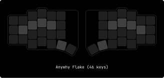
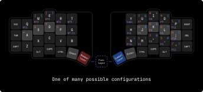
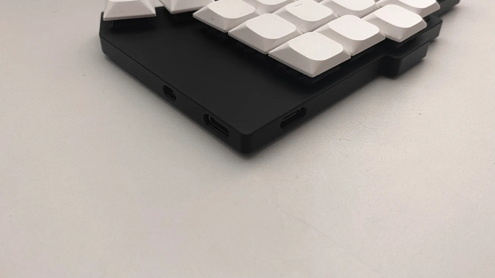
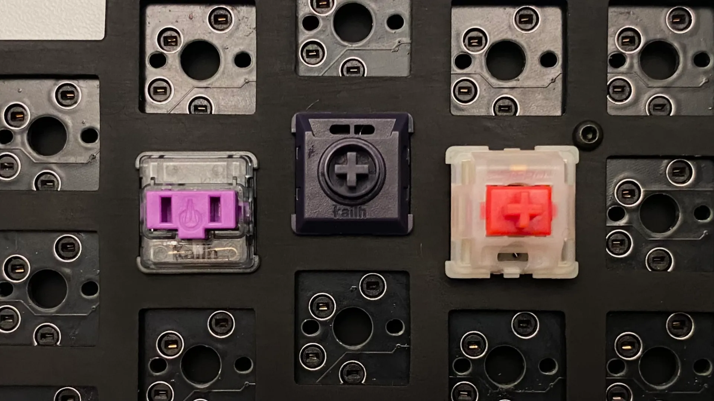

    
    <h3>Anywhy Flake</h3>
    
<i>Minimalism, efficiency and comfort</i>

# Why

_To be productive, stay healthy and enjoy the process._

By the 19th century, a need for a faster way of writing had emerged, which led to the invention of typewriters. Two centuries later, modern keyboards don't look much different from their predecessors, even though such design has been proven to be quite inefficient and often harmful.

Addressing these problems leads to huge benefits considering how often people use keyboards in the modern world.

# How

There are several problems that the Flake keyboard solves. I'll describe those with the most significant impact.

## Stagger

If you take your hand and look at the fingers, you can notice that they are positioned horizontally. Now take a look at your keyboard - the keys are grouped in arrays that are shifted vertically, known as row-based stagger.

This well-known layout forces your fingers to move in a counterintuitive way. The solution to that problem is simple: we need to rearrange the keys in a more human-friendly way.

As you can see, Flake has what's called a column-based stagger. Because of this, keys are located in the path of natural finger movement, which results in a much more pleasant typing experience and reduced fatigue.

## Split

One of the most noticeable things about Flake is that it has two separate halves.

Regular keyboards are made in a single monolithic block, and the main problem is that such a form factor requires our forearms to meet in the center. To compensate for this, wrists are bent apart. This position creates an unnatural angle between the forearm and the wrist, which in the long term will likely lead to constant wrist pain.

Each half of the split keyboard can be rotated and placed in any suitable way so everyone can adapt the setup to their personal preference, avoiding potential damage to the wrists.

As an added bonus, we get free space right between the halves which can be occupied by a trackpad, coffee, or even a cat (=^..^=).

## Keys amount

There's a high chance that some might feel confused seeing such a small number of keys, considering user productivity is one of the priorities for Anywhy.

Indeed, Flake has fewer keys than most conventional keyboards (46 keys in total), and that's not a compromise, but a feature. A large number of keys causes hands to move around to reach further-placed keys like digits, brackets, punctuation, Backspace, Escape, etc.

Having fewer keys doesn't mean less functionality. In fact, Flake is not only fully input-compatible with regular keyboards but also allows you to add more keys than most keyboards have.

By default, Flake uses [ZMK Firmware](https://zmk.dev) which provides functionality that significantly increases productivity. One of the most used features, which allows having all possible inputs with a minimal amount of keys, is [layers](https://zmk.dev/docs/keymaps#layers). They are pretty simple and work just like the well-known Shift key.

For those who strive for absolute comfort and compactness, there is also Flake S with 40 keys.

The small version lacks one outer column on each of the halves to reduce pinky usage, as it is the weakest of all fingers.

## Thumb cluster

Keyboards are used in various ways, not only for typing text. Most popular tasks require the use of mod keys such as Control, Alt/Option, Super/Command/Win, and of course, Shift. Even though these keys are regularly used, they are placed in ridiculously inconvenient spots where only the pinky can reach them, and as we already know, it's the weakest finger.

The Flake keyboard has a so-called thumb cluster which contains 10 keys in total to address that problem. In contrast, the thumb is one of the strongest fingers and is ideal for holding mod keys.

# What

Flake supports both wired and wireless (Bluetooth) connection, which makes it perfect for both home usage with a PC or portable setup with a laptop, tablet, or even smartphone.

To achieve both types of connectivity, each half has two USB-C ports, one on the top and one on the inner side. The side port is used to connect the halves together, and then one of them (usually the left one) can be connected to any device using the top port, which is also used to charge the keyboard.

> Ports on the side are used only to communicate with each other, so they can't be used to charge the keyboard or to flash the new firmware

Flake is extremely thin. The keyboard body without switches and feet is a bit less than 0.8cm in height, which makes it compact and really comfortable to use, especially with low-profile switches.

> Unfortunately, to achieve such a low height, some tradeoffs were made in PCB and enclosure designs that make assembly and soldering a bit tricky. There's a chance that the keyboard will become thicker in the future if it will make it more robust and easier to repair.

Talking about switches, Flake is hot-swappable and supports three types of switches: the well-known Cherry MX compatible switches, low-profile Kailh Choc V1, and their newer version Choc V2.

In order to use MX Switches, the special "plate" comes with the Flake which should be placed between the board and the switches.

> Plates are not required for the Choc switches as they are much lower than MX switches and don't need additional enclosure height to securely sit in the board

At the moment, the photos show Flake v0.1.0 which is fully tested, but the current repo's latest version is v0.1.1 which is not tested. In that update, I've changed the silkscreen and modified some edges, and I've also added PCB copper fill. Generally, these changes likely did not break anything and the PCB should work just fine. 

> If you build one, I would be glad to receive feedback from you :)

# Credits

Thank you to everyone who makes amazing things and publishes them for others to learn from and be inspired by; without you, Flake would probably never have happened. Huge thanks to:

- [@foostan](https://github.com/foostan), the author of [Corne Keyboard](https://github.com/foostan/crkbd) which was my introduction to the world of ergonomic keyboards.
  
- [@pashutk](https://github.com/pashutk), the author of [Chocofi](https://github.com/pashutk/chocofi), an amazing tiny keyboard I've been using for a while.
  
- [@josefadamcik](https://github.com/josefadamcik), the author of [Sofle](https://github.com/josefadamcik/SofleKeyboard) which gave huge inspiration for the Flake's key layout.
  
- [@petejohanson](https://github.com/petejohanson) for creating [ZMK Firmware](https://github.com/zmkfirmware/zmk) and all the [contributors](https://github.com/zmkfirmware/zmk/graphs/contributors) that make it better each day.

- People from the [ZMK discord server](https://zmk.dev/community/discord/invite) for being so kind while helping me learn how to design PCB and how to debug and solve various problems.

- Finally, a huge thank you to everyone who explores unpopular technologies, digs into niche topics, and makes amazing things possible.